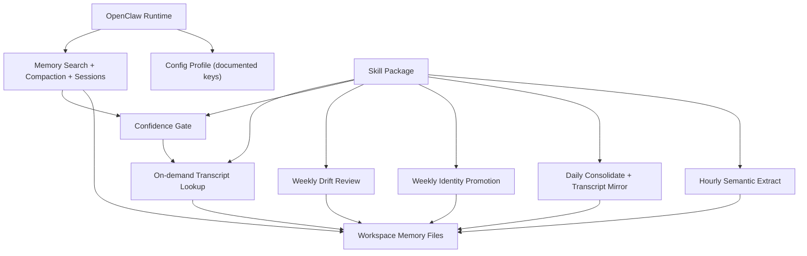

# Architecture

## Design Goal

Improve long-horizon memory quality while preserving upstream OpenClaw compatibility.

## System Split

## Memory Layers

1. Identity memory: stable user/project truths
2. Semantic memory: distilled medium-term knowledge
3. Episodic memory: short-horizon event memory
4. Transcript mirror: 7-day precision archive for manual recall (`archive/transcripts/`, default `sanitized` mode)

Identity sub-files:

1. `memory/identity/identity.md`
2. `memory/identity/preferences.md`
3. `memory/identity/decisions.md`

Identity recall priority:

1. `identity.md`
2. `preferences.md`
3. `decisions.md`

## Hard Boundaries

1. No OpenClaw core patching
2. No transcript auto-mix into default retrieval
3. No gateway session format modifications
4. No memory plugin forking for cadence
