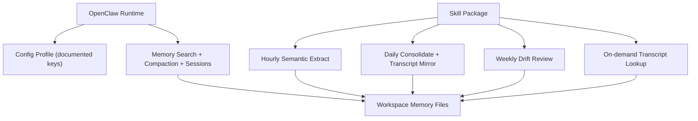

# Architecture

## Design Goal

Improve long-horizon memory quality while preserving upstream OpenClaw compatibility.

## System Split

## Memory Layers

1. Identity memory: stable user/project truths
2. Semantic memory: distilled medium-term knowledge
3. Episodic memory: short-horizon event memory
4. Transcript mirror: 7-day precision archive for manual recall

## Hard Boundaries

1. No OpenClaw core patching
2. No transcript auto-mix into default retrieval
3. No gateway session format modifications
4. No memory plugin forking for cadence

